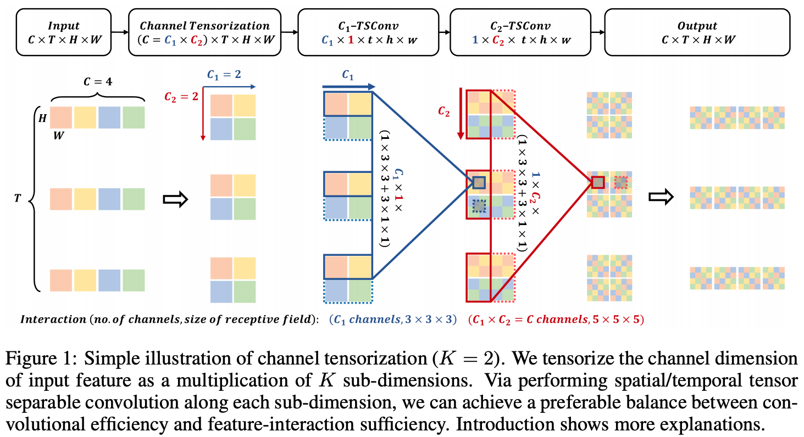
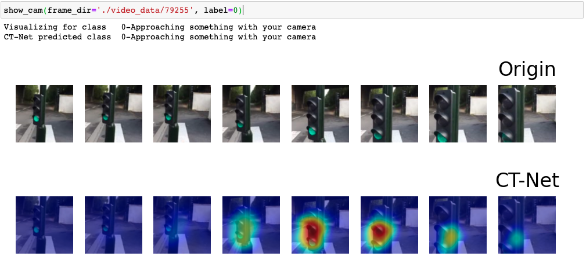

# [ICLR2021] CT-Net: Channel Tensorization Network for Video Classification

```
@inproceedings{
li2021ctnet,
title={{\{}CT{\}}-Net: Channel Tensorization Network for Video Classification},
author={Kunchang Li and Xianhang Li and Yali Wang and Jun Wang and Yu Qiao},
booktitle={International Conference on Learning Representations},
year={2021},
url={https://openreview.net/forum?id=UoaQUQREMOs}
}
```
[](https://paperswithcode.com/sota/action-recognition-in-videos-on-something-1?p=ct-net-channel-tensorization-network-for-1)
[](https://paperswithcode.com/sota/action-recognition-in-videos-on-something?p=ct-net-channel-tensorization-network-for-1)	
[](https://paperswithcode.com/sota/action-classification-on-kinetics-400?p=ct-net-channel-tensorization-network-for-1)

## Overview
**[2021/6/3]** We release the PyTorch code of  [CT-Net](https://openreview.net/forum?id=UoaQUQREMOs). More details and models will be available.



## Model Zoo
More models will be released in a month...

Now we release the model for visualization, please download it from [here](https://pan.baidu.com/s/1DbFk9hud2ELnLa78RxqEkg) and put it in `./model`.  **(passward: t3to)**

## Install

```shell
pip install -r requirements.txt
```

## Dataset

In our paper, we conduct experiments on Kinetics-400, Something-Something V1&V2, UCF101, and HMDB51. Please refer to [TSM repo](https://github.com/mit-han-lab/temporal-shift-module) for the detailed guide of data pre-processing.

## Training and Testing

Please refer to `scripts/train.sh` and `scripts/test.sh`, more details can be found in the appendix of our paper.

### Setting environment
```shell
source ./init.sh
```

### Training

We use `dense sampling` and `uniform sampling` for Kinetics and Something-Something respecitively.
```shell
CUDA_VISIBLE_DEVICES=0,1,2,3,4,5,6,7 \
python3 main.py something RGB \
     --root-log ./log \
     --root-model ./model \
     --arch resnet50 --model CT_Net --num-segments 8 \
     --gd 20 --lr 0.02 --unfrozen-epoch 0 --lr-type cos \
     --warmup 10 --tune-epoch 10 --tune-lr 0.02 --epochs 45 \
     --batch-size 8 -j 24 --dropout 0.3 --consensus-type=avg \
     --npb --num-total 7 --full-res --gpus 0 1 2 3 4 5 6 7 --suffix 2021
```

### Testing
```shell
CUDA_VISIBLE_DEVICES=0,1,2,3,4,5,6,7 \
python3 test_acc.py something RGB \
     --arch resnet50 --model CT_Net --num-segments 8 \
     --batch-size 64 -j 8 --consensus-type=avg \
     --resume ./model/ct_net_8f_r50.pth.tar \
     --npb --num-total 7 --evaluate --test-crops 1 --full-res --gpus 0 1 2 3 4 5 6 7
```

##  Demo and visiualization

See `demo/show_cam.ipynb`，
1. `source ./init.sh`
2. `cd demo`
3. `jupyter notebook`


